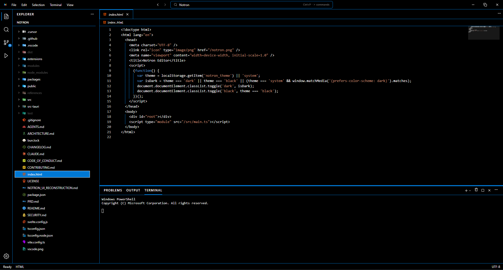

<p align="center">
  
</p>

<h1 align="center">Notron</h1>

<p align="center">
  A modern, minimal yet powerful desktop code editor.
  <br />
  Built with <b>Tauri</b> (Rust) + <b>Svelte 5</b>, powered by the <b>CodeMirror 6</b> engine.
</p>

<p align="center">
  <a href="https://github.com/fazelstudio/notron/blob/main/LICENSE"></a>
  <a href="https://github.com/fazelstudio/notron"></a>
  <a href="https://github.com/fazelstudio/notron/issues"></a>
  <a href="https://bun.sh"></a>
  <a href="https://v2.tauri.app"></a>
  <a href="https://svelte.dev"></a>
</p>

---

**Notron** is a modern desktop code editor designed for speed, efficiency, and a minimal yet powerful user experience. Built with **Tauri** (Rust) on the backend and **Svelte 5** on the frontend, Notron delivers native application performance with the flexibility of web technologies — light on memory, fast at startup, and a joy to use.

<p align="center">
  
</p>

## ✨ Features

- **File Tree Explorer** — hierarchical folder navigation with full CRUD operations, copy/cut/paste, and real-time file watching.
- **CodeMirror 6 Editor** — multi-tab editing with syntax highlighting for many languages (JS, TS, Rust, Python, Go, C++, and more).
- **Lazy Loading** — file contents are only loaded into memory when the tab is active to save RAM.
- **Auto-save** — automatic saving with a configurable interval.
- **Command Palette** (`Ctrl+Shift+P`) — quick access to every application command.
- **Symbol Engine** — "Go to Definition" and "Find References" navigation powered by regex-based extraction.
- **Global Search & Replace All** — text search across the entire workspace (ripgrep engine) with automatic directory filtering.
- **Workspace Restoration** — remembers the last folder, sidebar layout, and open tabs on relaunch.
- **Custom Title Bar** — a frameless window that blends seamlessly with the operating system.
- **Theming** — Dark and Light themes, plus an option to follow the OS scheme.
- **Markdown Preview** — real-time visual rendering for `.md` files.
- **Image Viewer** — preview image files directly in a tab.
- **Integrated Terminal** — xterm.js-powered terminal.
- **Source Control (Git)** — staging, commits, push/pull, and diffs.
- **Run & Debug** — DAP (Debug Adapter Protocol) support with breakpoints.
- **Runtime Extensions** — install validated `.ntrn` packages from the Command Palette
  (`Extensions: Install from .ntrn…`). Packages are persisted in the application data
  directory, discovered at startup and workspace changes, and activated through the
  `notron-sdk` lifecycle.

### Runtime extension packages

Build packages with the SDK CLI (`ntrn package`), then install them from the command
palette. Notron validates the manifest and bundled JavaScript entry point, rejects
archive path traversal, limits archive size, and extracts atomically. Installed
extensions may import only `notron-sdk`; the host loads the CLI's bundled CommonJS
entry and honors `activationEvents` such as `onStartupFinished`, `onCommand:*`, and
`workspaceContains:*`. Arbitrary native/Node modules are intentionally not supported
inside the webview runtime.

## 🧱 Architecture

| Component       | Technology                            |
| --------------- | ------------------------------------- |
| Package Manager | [Bun](https://bun.sh)                  |
| Stack           | Tauri + Svelte + Rust                 |
| Frontend        | [Svelte 5](https://svelte.dev) (Runes) |
| Backend         | [Tauri 2](https://v2.tauri.app) (Rust) |
| Engine          | [CodeMirror 6](https://codemirror.net) |
| Styling         | Vanilla CSS & Tailwind CSS            |

## 🚀 Prerequisites

- [Bun](https://bun.sh) (>= 1.x)
- [Rust](https://www.rust-lang.org) (stable toolchain)
- [Node.js](https://nodejs.org) (>= 18)

System dependencies for Tauri: see the platform-specific [Prerequisites](https://v2.tauri.app/start/prerequisites/) (WebView2 on Windows, WebKitGTK on Linux, etc.).

## 🛠️ Development

```bash
bun install          # install dependencies
bun run tauri dev    # launch the desktop app
```

Frontend only (browser):

```bash
bun run dev          # http://localhost:1420
```

## 📦 Production Build

```bash
bun run tauri build  # produces native binaries in src-tauri/target/release
```

## 📂 Project Structure

```
src/                  Svelte 5 frontend
  lib/commands/       Command & keybinding registries
  lib/workbench/      Shell registries (activity bar, sidebar, status bar, menus, preview)
  lib/components/     UI (shell, editor, explorer, panels, common)
  lib/contrib/        Built-in features (explorer, search, scm, terminal, editor)
  lib/services/       Services (git, run, file, notification, session)
  lib/stores/         Stores (editor, split, terminal, ui, settings)
  lib/utils/          Helpers (path, explorer, symbol engine, eventBus)
  lib/platform/       IPC catalog & keybinding service
  lib/sdk/            Extension API types
src-tauri/            Rust backend (Tauri)
  src/                Commands and services (db, search, watcher, git, debug)
public/               Static assets
```

## 🤝 Contributing

Contributions are welcome! Please read the [CONTRIBUTING.md](CONTRIBUTING.md) and [CODE_OF_CONDUCT.md](CODE_OF_CONDUCT.md) first.

1. Fork this repository.
2. Create a feature branch (`git checkout -b feat/amazing-feature`).
3. Commit your changes (`git commit -m 'feat: add amazing feature'`).
4. Push to the branch (`git push origin feat/amazing-feature`).
5. Open a Pull Request.

## 🔒 Security

If you discover a vulnerability, please report it following the guidelines in [SECURITY.md](SECURITY.md). Do not open a public issue for sensitive vulnerabilities.

## 📝 License

Distributed under the [MIT License](LICENSE). Copyright © 2026 **fazelstudio (Zulfazli)**.
